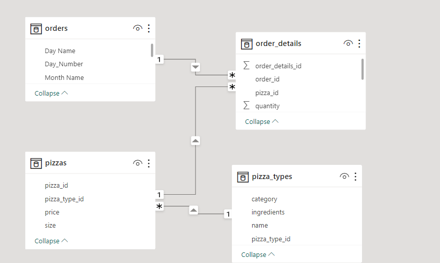
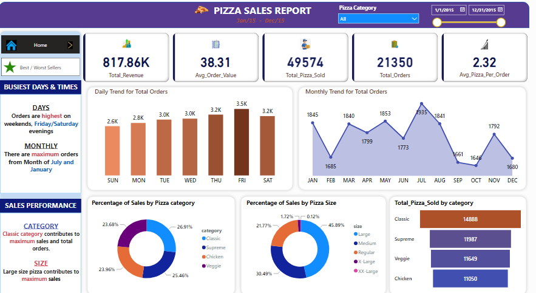

# Pizza-Sales-Report

 
***

## Introduction
This is a PowerBI project on Pizza Sales using data for the year 2015.
This pizza company needs to analyze their data to understand customer preferences, optimize inventory, streamline operations, target marketing efforts effectively, ensure quality control, and stay ahead of competitors.

## Problem Statement

## KPI's
1. Total Revenue
2. Average order value
3. Total Pizza sold
4. Total orders
5. Average pizza per order

## Charts Requirement
1. Daily trend for total orders
2. Monthly trend for total orders
3. Percentage of sales by Pizza Category
4. Percentages of sales by Pizza size
5. Total pizza sold by size category
6. Top 5 best sellers by Revenue, Total, Quantity and Total Orders
7. Bottom 5 sellers by Revenue, Total, Quantity and Total Orders
   

## Skills/ concepts demonstrated:
I used the following PowerBI features:

### Data Preparation and Modeling
1. **Data Import and Integration:**
   - Imported data from excel.
   - Use Power Query to clean, transform, and shape data.
   - Merge and append data from multiple sources.

2. **Data Modeling:**
   - PowerBI automatically created relationships between tables.
   - I developed calculated columns and measures using DAX (Data Analysis Expressions).
   - I implemented hierarchies and role-playing dimensions.

***

### Data Analysis and DAX
3. **Basic DAX:**
   - I wrote simple DAX formulas for calculated columns and measures.
   - I used basic DAX functions such as SUM, DINSTINCTCOUNT, RELATED.

### Data Visualization
4. **Creating Visualizations:**
   - I used different types of charts (bar, line, pie)
   - I utilized slicers for interactive filtering.

6. **Formatting and Aesthetics:**
   - Apply themes and formatting to ensure visual consistency.
   - Use conditional formatting to highlight important data points.
   - Arrange and align visuals for a clean, professional look.

### Interactive Features
7. **Interactivity:**
   - Create and configure report-level, page-level, and visual-level filters.
   - Implement drill-throughs to navigate between report pages.
   - Use bookmarks and buttons to create interactive storytelling experiences.

### Analytical Skills
14. **Data Insights:**
    - Analyze and interpret data trends and patterns.
    - Create KPIs to track key performance metrics.
    - Use statistical methods to provide deeper insights.

You can interact with the report [here](https://drive.google.com/file/d/1PyxHfCKgal2GOKPRUq3GkpdyWyK0P3in/view?usp=sharing)

## Visualization: 
The dashboard was created by using different types of charts (bar, line, pie). I utilized slicers for interactive filtering. I applied themes and formatting to ensure visual consistency. I used conditional formatting to highlight important data points. Finally i arranged and align the visuals for a clean, professional look.

Below is a snippet of the final dashboard in PowerBI.

***

# Key Insight
- Total Revenue: The dashboard shows a significant total revenue of $817,860 in 2015.

- Peak Orders: Orders are highest on weekends, Friday/Saturday evenings and there are maximum orders from Month of July and January

- Sales performance:
   By catogory: Classic category contributes to maximum sales and total orders.
   By size: Large size pizza contributes to maximum sales
- Best sellers
   By Revenue: The Thai Chicken contributes the maximum Revenue.
   By Quantity: The Classic Deluxe Pizza Contributes to maximum Total Quantities.
   By Total Orders: The Classic Deluxe Pizza Contributes to maximum Total Orders.
- Worse sellers
   By Revenue: The Brie Carre Pizza contributes the minimum Revenue.
   By Quantity: The Brie Carre Pizza Contributes to minimum Total Quantities.
   By Total Orders: The Brie Carre Pizza Contributes to minimum Total Orders.

  
# Recommendations
1. Increase marketing efforts during weekends, Friday/Saturday evenings, and peak months (July and January).
2. Promote and bundle the Classic Deluxe Pizza; consider premium pricing or signature dish promotion for Thai Chicken Pizza.
3. Evaluate the necessity of the Brie Carre Pizza; consider rebranding, recipe alteration, or discounting.
4. Introduce new varieties or limited editions within the Classic category and explore new size options or combo deals featuring large pizzas.
5. Align staff schedules and resources to peak times; ensure a robust supply chain to avoid stockouts during peak periods.
6. Monitor inventory levels of best-selling items closely to ensure constant availability.
7. Implement loyalty programs rewarding frequent purchases, especially of best-selling items.
8. Gather customer feedback on poor-performing items to identify potential improvements.

# Conclusion
Implementing these recommendations will likely lead to increased sales, improved customer satisfaction, and better overall business performance.

Thank you for your interest and time. Your valuable suggestions are welcome. Feel free to connect with me for further discussion.
[here](www.linkedin.com/in/cecilia-ojile-a180541a4)
